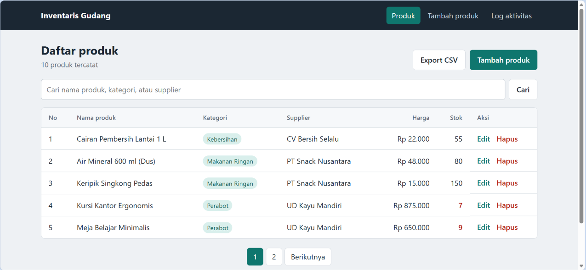
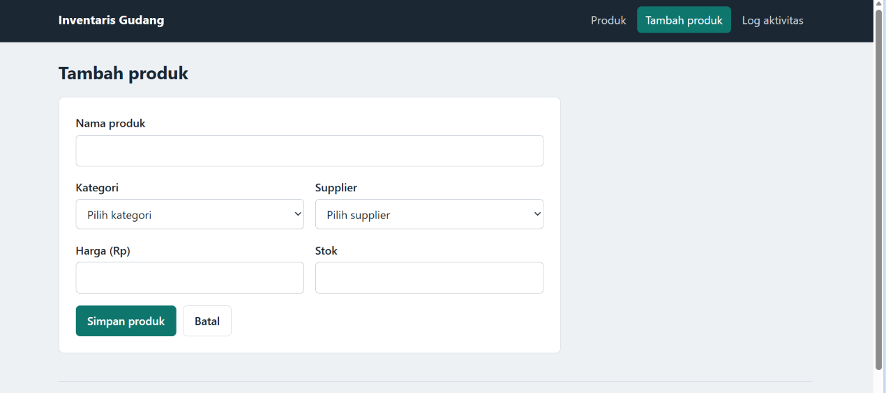
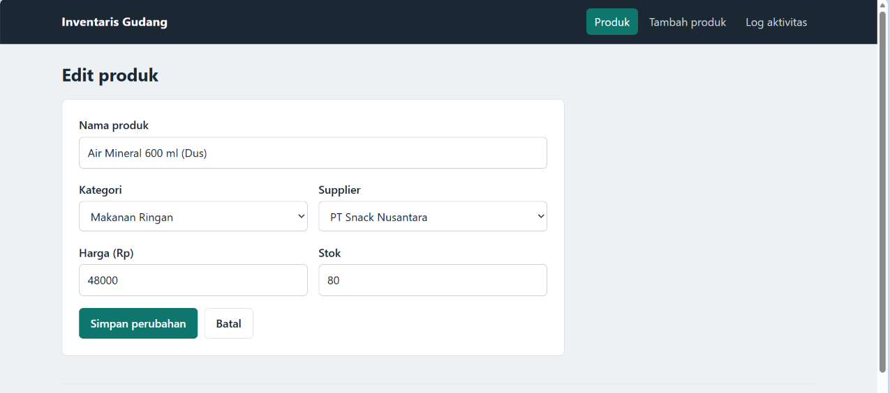
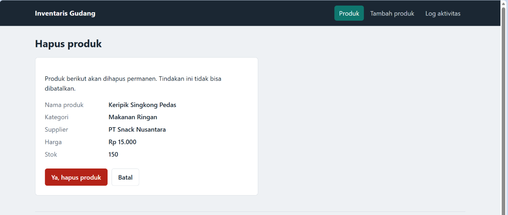
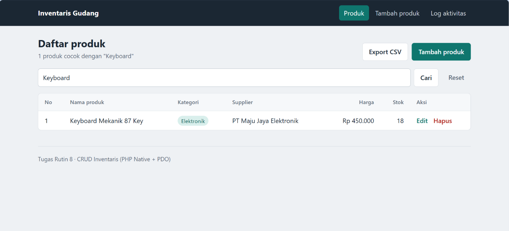
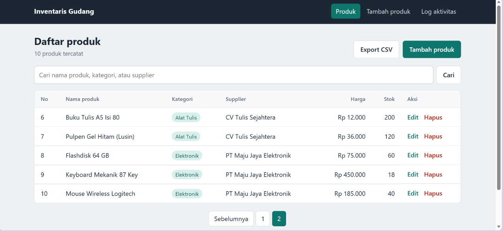
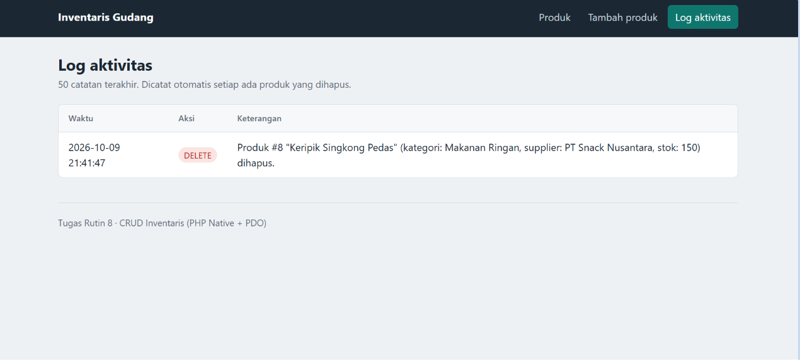
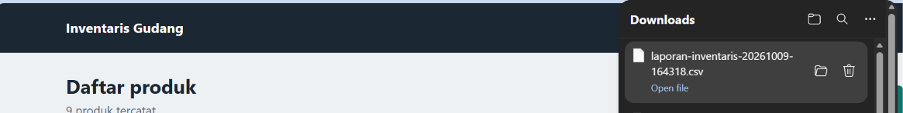

# CRUD Inventaris - Tugas Rutin 8

Aplikasi CRUD inventaris produk dengan **PHP Native + PDO + MySQL**.

## Fitur

**Wajib**
- Database `inventaris_db` dengan 3 tabel berelasi: `kategori`, `supplier`, `produk` (produk memakai 2 foreign key)
- Minimal 5 data seed per tabel
- Koneksi PDO dengan Singleton pattern (`config/database.php`)
- Halaman list produk dengan JOIN ke tabel kategori dan supplier
- Form tambah produk dengan dropdown kategori dan supplier
- Edit produk (form terisi otomatis) dan hapus produk (halaman konfirmasi)
- Semua query memakai prepared statements
- Semua output HTML memakai `htmlspecialchars()` lewat helper `e()`
- Flash message sukses/gagal dengan pola Post/Redirect/Get
- Tampilan rapi dengan CSS sendiri (`assets/style.css`)

**Bonus**
- Transaction pada hapus produk: log aktivitas dan penghapusan berhasil bersamaan, atau dibatalkan semua
- Pencarian (nama produk, kategori, supplier)
- Pagination (5 data per halaman)
- Export laporan ke CSV
- Perlindungan CSRF pada semua form POST

## Struktur folder

```
TugasWeb-Pertemuan8-CRUD/
├── schema.sql              # struktur tabel + data seed
├── config/database.php     # koneksi PDO (Singleton)
├── includes/               # header, footer, form bersama, fungsi helper
├── assets/style.css
├── index.php               # list + cari + pagination
├── create.php              # tambah produk
├── edit.php                # ubah produk
├── delete.php              # konfirmasi + hapus (transaction)
├── log.php                 # riwayat penghapusan
└── export.php              # export CSV
```

## Cara menjalankan

1. Pastikan PHP 8.1+ dan MySQL/MariaDB aktif (misalnya lewat XAMPP atau Laragon).
2. **Import database**: buka phpMyAdmin, pilih tab *Import*, pilih file `schema.sql`, lalu klik *Go*.
   Atau lewat terminal: `mysql -u root -p < schema.sql`
3. Cek `config/database.php`, sesuaikan `DB_USER` dan `DB_PASS` bila MySQL kamu memakai password.
4. Letakkan folder project di `htdocs` (XAMPP) atau `www` (Laragon), lalu buka
   `http://localhost/TugasWeb-Pertemuan8-CRUD/`.
   Alternatif: jalankan `php -S localhost:8000` di dalam folder project, lalu buka `http://localhost:8000`.

## Screenshot

### Fitur Wajib

| Halaman | Screenshot |
|---|---|
| Daftar produk |  |
| Tambah produk |  |
| Edit produk |  |
| Konfirmasi hapus |  |

### Fitur Bonus

| Fitur | Screenshot |
|---|---|
| Pencarian |  |
| Pagination |  |
| Log aktivitas (hasil transaction) |  |
| Export CSV |  |
